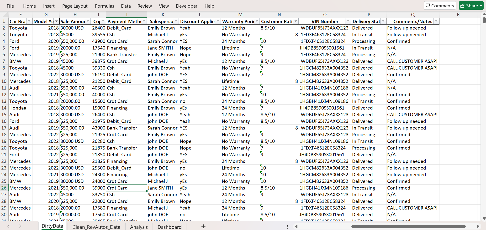
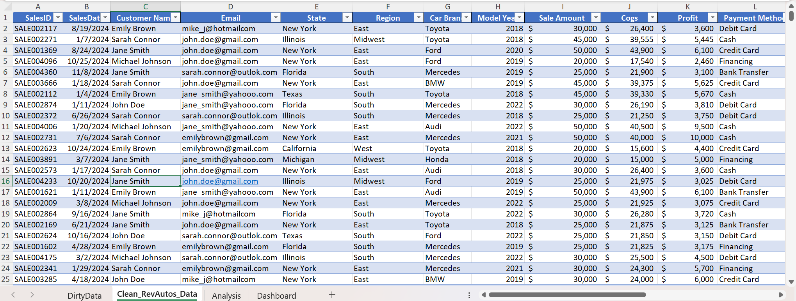

# Rev Auto Sales Dashboard

## Project Overview
This project addresses data management challenges at RevAutos, a mid-sized car dealership that operates across multiple states in the US. The company was experiencing significant difficulties with data inconsistencies and unstructured records, resulting in duplicate customer entries, inconsistent sales reporting, incorrect data formatting, and ultimately inaccurate revenue tracking and ineffective customer satisfaction measurement.

## About RevAutos
RevAutos specializes in selling various car brands and models, catering to different customer needs and budgets. The company offers flexible payment options, extended warranties, and after-sales services to enhance customer satisfaction.

## Problem Statement
RevAutos was facing several data management issues that hindered their ability to make data-driven decisions:

- Data inconsistencies and unstructured record
- Duplicate customer entries
- Inconsistent sales reporting
- Incorrect data formatting
- Inaccurate revenue tracking
- Ineffective customer satisfaction rating system

## Methodology  
### 1. Data Cleaning Process
- Identification of Unique Keys: Used SalesID as the primary unique identifier to detect and eliminate duplicate records
- Data Standardization: Corrected inconsistent formatting in fields such as sale amounts, car brands, and payment methods
- Email and Contact Information Validation: Ensured customer contact details were properly formatted and consistent
- Removal of Duplicates: Eliminated duplicate entries based on SalesID to maintain data integrity
- Data Structure Reorganization: Restructured the dataset with consistent column names and data types

Raw Dataset                                         |                              Cleaned Dataset
:--------------------------------------------------:|:--------------------------------------------:
                                 

### 2. Analysis Approach
