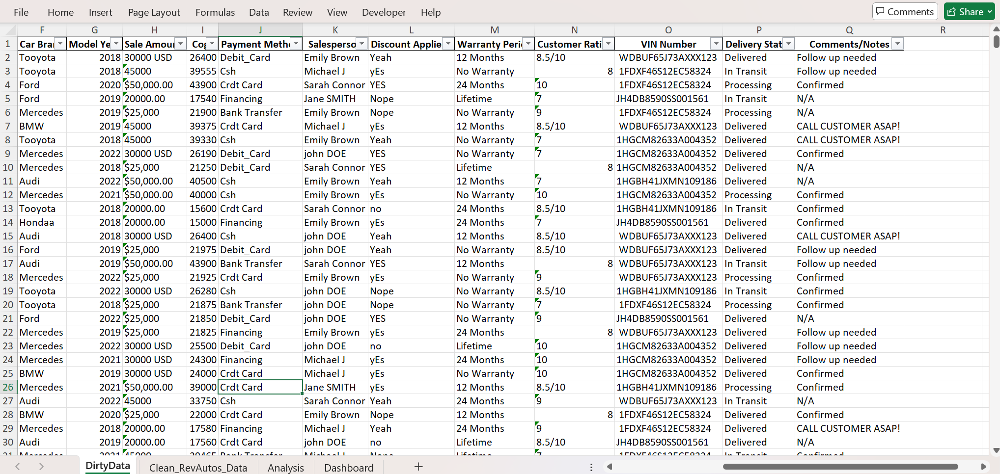
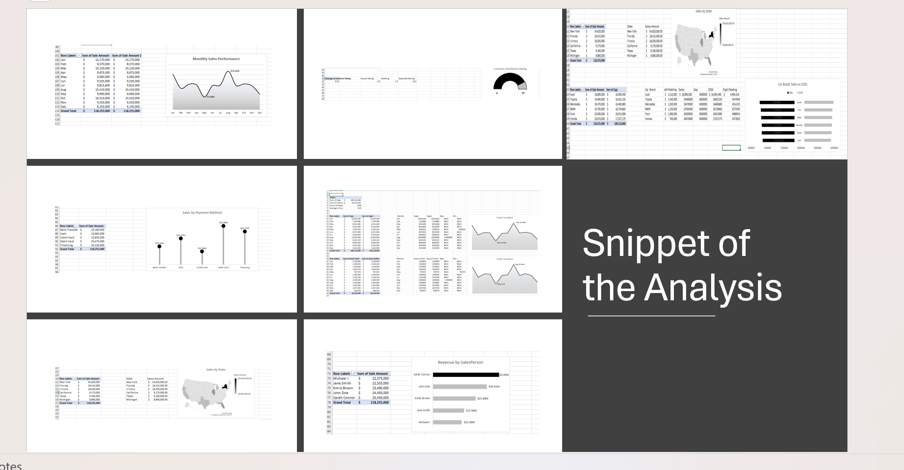

# Rev Auto Sales Dashboard

## Project Overview
This project addresses data management challenges at RevAutos, a mid-sized car dealership that operates across multiple states in the US. The company was experiencing significant difficulties with data inconsistencies and unstructured records, resulting in duplicate customer entries, inconsistent sales reporting, incorrect data formatting, and ultimately inaccurate revenue tracking and ineffective customer satisfaction measurement.

## About RevAutos
RevAutos specializes in selling various car brands and models, catering to different customer needs and budgets. The company offers flexible payment options, extended warranties, and after-sales services to enhance customer satisfaction.

## Problem Statement
RevAutos was facing several data management issues that hindered their ability to make data-driven decisions:

- Data inconsistencies and unstructured record
- Duplicate customer entries
- Inconsistent sales reporting
- Incorrect data formatting
- Inaccurate revenue tracking
- Ineffective customer satisfaction rating system

## Methodology  
### Data Cleaning Process
1. Identification of Unique Keys: Used SalesID as the primary unique identifier to detect and eliminate duplicate records
2. Data Standardization: Corrected inconsistent formatting in fields such as sale amounts, car brands, and payment methods
3. Email and Contact Information Validation: Ensured customer contact details were properly formatted and consistent
4. Removal of Duplicates: Eliminated duplicate entries based on SalesID to maintain data integrity
5. Data Structure Reorganization: Restructured the dataset with consistent column names and data types

Raw Dataset                                         |                              Cleaned Dataset
:--------------------------------------------------:|:--------------------------------------------:
                                | 

### Analysis Approach

After cleaning the data, the following analyses were performed:

1. Financial Performance Analysis

  - Tracked total cost of goods sold (COGS) over time
  - Analyzed total profit and monthly fluctuations
  - Examined order volumes and trends

2. Customer Insights

  - Evaluated overall customer satisfaction ratings
  - Correlated satisfaction ratings with business performance

3. Sales Analysis

  - Analyzed sales fluctuations throughout the year
  - Compared sales volumes across different payment methods
  - Evaluated performance of different car brands
  - Examined geographic distribution of sales by state

4. Employee Performance Analysis

  - Identified top-performing salespeople
  - Compared revenue generation across the sales team

## Key Findings
Based on the analysis performed, several insights were uncovered:

- Financial Performance: The company has generated $100,110,460 in COGS and $18,144,540 in total profit from 3500 orders
- Customer Satisfaction: The average customer satisfaction rating is 8.53/10
- Sales Performance:
    - Monthly sales show significant fluctuations with peaks appearing in August
    - Credit Card and Debit Card appear to be the highest revenue-generating payment methods
    - New York, Florida, and Texas are major contributors to total sales
    - Sarah Connor is the top-performing salesperson with approximately $25.43M in revenue

      
